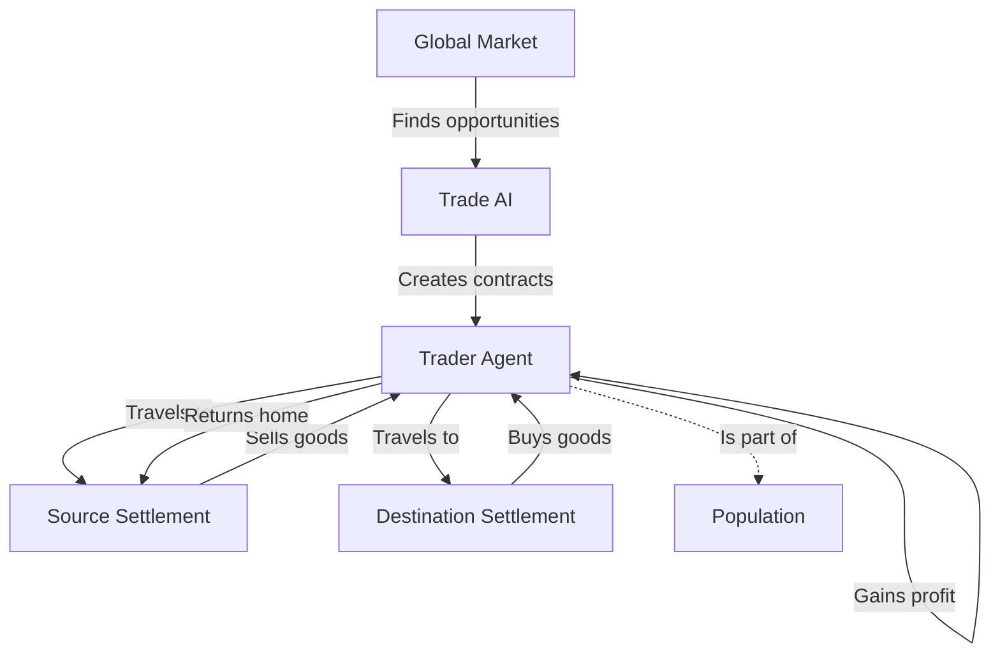

# Trade & Transportation System - Implementation Summary

## Overview

The Trade System creates a living economy where **traders are mobile population units** that transport goods between settlements, enabling specialized settlements to survive by trading their surplus for necessities.

## Problem Solved

**Before Trade System:**
- Mining hamlets with no food production → Starvation and death
- Farming villages with excess food → Wasted surplus
- No economic interdependence between settlements

**After Trade System:**
- Traders automatically find supply/demand imbalances
- Food flows from farming villages to mining towns
- Ore flows from mines to cities with smelters
- Settlements specialize and depend on each other

## Architecture



## Core Components

### 1. Trader Entity (`src/world/trade/Trader.ts`)

**Traders are mobile population units:**
- Linked to a `Person` entity (count as population)
- Move on the map like characters
- Have inventory with carrying capacity (50-150 units)
- Earn money and profit from trades
- Gain trading skill experience (affects capacity and speed)

**States:**
- `idle` - Looking for trade opportunities
- `traveling_to_buy` - Moving to source settlement
- `buying` - Purchasing goods
- `traveling_to_sell` - Moving to destination
- `selling` - Delivering and selling goods
- `returning_home` - Going back to home settlement

**Key Features:**
- Carrying capacity: 50 base + skill bonus (up to 150)
- Move speed: 3 tiles/turn (5 on roads, +skill bonus)
- Starting capital: 100 gold

### 2. Market System (`src/world/trade/Market.ts`)

**Supply & Demand Economics:**
- Each settlement has a market tracking supply/demand
- Prices adjust dynamically based on availability
- Buy orders for shortages (especially food)
- Sell orders for surplus goods

**Dynamic Pricing:**
```typescript
// Price calculation formula:
ratio = demand / supply

if (ratio > 3): price = basePrice × 2.0  // Very high demand
if (ratio > 2): price = basePrice × 1.5  // High demand
if (ratio > 1): price = basePrice × 1.2  // Moderate demand
if (ratio < 0.3): price = basePrice × 0.5 // Very low demand
else: price = basePrice
```

**Base Prices (gold per unit):**
- Bread: 2g (critical food)
- Meat: 3g
- Copper: 5g
- Iron: 8g
- Coal: 4g
- Copper Ingot: 10g
- Iron Sword: 40g

### 3. Trade Routes (`src/world/trade/TradeRoutes.ts`)

**Cached Pathfinding:**
- Finds optimal paths between settlements
- Caches routes for performance
- Prefers roads (faster travel)
- Calculates distance and danger levels

### 4. Trade AI (`src/world/trade/TradeAI.ts`)

**Intelligent Opportunity Finding:**
- Matches buy orders with sell orders
- Calculates profitability (revenue - cost - transport)
- Prioritizes critical needs (food for starving)
- Selects best trades for each trader

**Priority System:**
```typescript
Priority Levels:
100 = Critical food shortage (>50 units short)
80 = Moderate food shortage (>20 units short)
60 = Production inputs (ore, coal)
30 = General goods and surplus
```

**Profit Calculation:**
```typescript
grossProfit = (sellPrice - buyPrice) × quantity
transportCost = distance / 10 (1g per 10 tiles)
netProfit = grossProfit - transportCost
profitPerTile = netProfit / distance
```

### 5. Trade Manager (`src/world/trade/TradeManager.ts`)

**Global Trade Orchestration:**
- Manages all traders across the world
- Updates all markets each turn
- Spawns traders when settlements have trading buildings
- Processes trader AI and movement
- Cleans up dead/retired traders

**Trader Spawning Rules:**
- Settlement must have Trading Post or Warehouse
- Must have unemployed population
- Max traders: Cities (3), Villages (2), Hamlets (1)
- Prefers people with Merchant skill

### 6. Trader Renderer (`src/rendering/TraderRenderer.ts`)

**Visual Representation:**
- Traders appear as small merchant sprites on the map
- Color-coded by state (blue = idle, green = traveling, gold = buying, etc.)
- Shows cargo indicator when carrying goods
- Clickable for detailed information

## Game Loop Integration

### Turn Processing Order:

```typescript
1. Life Simulation (aging, food, health)
2. Worker Assignment
3. Resource Extraction
4. Production
5. Experience Gain
6. Population Dynamics
7. Trade Processing ← NEW
   a. Update all markets (supply/demand/prices)
   b. Find trade opportunities
   c. Spawn new traders if needed
   d. Process each trader's AI
   e. Move traders along routes
   f. Execute buy/sell transactions
```

## How It Works

### Example: Mining Hamlet Rescue

**Turn 1-3:**
```
Mining Hamlet (Settlement 5):
- 5 people, 1 Iron Mine
- Food: 10 bread
- Production: +7 iron/turn
- Consumption: -10 food/turn
- Result: Food depleting, people will starve soon
```

**Turn 4: Market Responds**
```
Market Analysis:
- Mining Hamlet: CRITICAL - Needs 20 bread (priority 85)
- Farming Village: Has 80 excess bread (priority 40)
- Distance: 15 tiles
- Profit: (4g sell - 2g buy) × 20 = 40g - 1.5g transport = 38.5g profit
→ Trade opportunity created!
```

**Turn 5: Trader Assigned**
```
[Trade] Created trader Aldric Miller at settlement 3 (Farming Village)
[Trade] Aldric accepted contract: 20 bread from 3 to 5 (profit: 38g)
State: traveling_to_buy (already at source, instant buy)
```

**Turn 6-7: Trading**
```
Turn 6:
- Aldric buys 20 bread for 40g at Farming Village
- State: traveling_to_sell
- Moving 5 tiles/turn on roads

Turn 7:
- Aldric continues traveling (10 more tiles)
```

**Turn 8: Delivery**
```
- Aldric arrives at Mining Hamlet
- Sells 20 bread for 80g
- Profit: 40g (keeps it as money)
- Mining Hamlet food stockpile: 10 → 30 bread
- People no longer starving!
- Aldric returns to idle state
```

**Ongoing:**
- Every few turns, traders bring more food
- Mining hamlet survives by trading iron
- Circular economy established!

## HUD Display

### Settlement Tooltip (NEW Section)

```
--- Trade ---
• Active Traders: 2
• Buying: Bread x20
• Selling: Copper x50
```

### Trader Tooltip (when clicking trader)

```
Merchant: Aldric Miller
• From: Mining Town
• To: City
• Cargo: 40 Copper
• Profit: +120g
• ETA: 3 turns
```

## Balance & Tuning

### Trade Economics

**Transport Efficiency:**
- Short routes (< 10 tiles): Very profitable
- Medium routes (10-30 tiles): Profitable
- Long routes (> 30 tiles): Only for high-value goods

**Trade Frequency:**
- Food trades: Every 3-5 turns (as settlements deplete)
- Resource trades: Every 5-10 turns (as production needs materials)
- Luxury trades: Occasional (low priority)

### Trader Capacity

```typescript
Base: 50 units
+ Skill bonus: +1 per skill point (up to +100)
Maximum: 150 units

Examples:
- Novice (skill 0): 50 units = 25 bread deliveries
- Trained (skill 50): 100 units = 50 bread deliveries
- Master (skill 100): 150 units = 75 bread deliveries
```

### Movement Speed

```typescript
Base: 3 tiles/turn
On roads: +2 tiles/turn = 5 tiles/turn
Skill bonus (at 50): +1 tile/turn
Skill bonus (at 100): +2 tiles/turn

Master on roads: 7 tiles/turn!
```

## Testing

### Test Scenario 1: Food Rescue

1. Start game, find a mining hamlet
2. Watch its food stockpile deplete (2 food/person/turn)
3. By turn 5-7, should see trader created
4. Trader travels to nearby farming settlement
5. Returns with food delivery
6. Mining hamlet population stabilizes

### Test Scenario 2: Production Chain

1. Find settlements:
   - Settlement A: Copper Mine (excess copper ore)
   - Settlement B: Smelter (needs copper)
   - Settlement C: Smithy (needs ingots)
2. Watch traders create supply chain:
   - Trader brings copper ore to smelter
   - Smelter produces ingots
   - Trader brings ingots to smithy
   - Smithy produces weapons

### Console Commands

```javascript
// Check active traders
console.log(game.tradeManager.getAllTraders());

// Check market offers for settlement 0
const market = game.tradeManager.getGlobalMarket().getMarket(0);
console.log('Buy offers:', market.getBuyOffers());
console.log('Sell offers:', market.getSellOffers());
```

## Impact on Gameplay

### Before Trade System:
- ❌ Specialized settlements die
- ❌ Food production must be local
- ❌ No economic specialization
- ❌ Isolated economies

### After Trade System:
- ✅ Settlements can specialize
- ✅ Mining towns survive by trading
- ✅ Economic interdependence
- ✅ Living trade network
- ✅ Visible economy (traders on map)
- ✅ Dynamic prices
- ✅ Automatic optimization (AI finds best trades)

## Future Enhancements (Phase 4)

1. **Multiple Traders Per Settlement** - Scale with settlement size
2. **Caravans** - Groups of traders traveling together
3. **Trade Agreements** - Regular routes with scheduled deliveries
4. **Bandit System** - Traders can be attacked, need guards
5. **Player Trading** - Player can become a trader
6. **Ship Trading** - Water-based trade routes
7. **Trade Guilds** - Traders form organizations
8. **Foreign Trade** - Trade with off-map civilizations

## Implementation Complete

All Phases 1-3 implemented:
- ✅ Core infrastructure (Trader, Market, Routes)
- ✅ Trade AI (opportunity finding, prioritization)
- ✅ Market economy (dynamic pricing, supply/demand)
- ✅ Visual rendering (traders on map)
- ✅ HUD integration (trade information)
- ✅ Full game loop integration

**The economy is now alive with autonomous traders saving settlements from starvation!**
