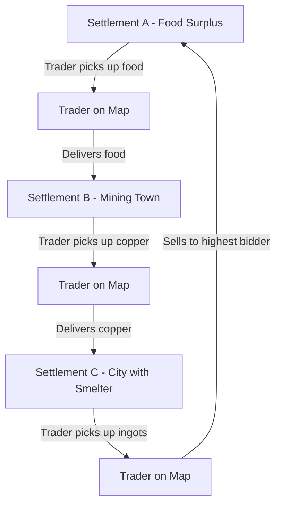

# Trade & Transportation System

## Problem Statement

Specialized settlements (mining towns, lumber camps, etc.) are dying from starvation because they only produce one resource and can't feed their population. We need traders to transport goods between settlements to create a functioning economy.

## Core Concept

**Traders are population units** that become mobile characters on the map, moving goods from surplus settlements to deficit settlements, creating economic interdependence.

## Architecture Overview



## Data Structures

### 1. Trader Entity (`src/world/trade/Trader.ts`)

```typescript
export interface TraderInventory {
  goods: Map<GoodType, number>;
  resources: Map<ResourceType, number>;
  capacity: number; // Max carrying capacity (e.g., 100 units)
}

export interface TradeContract {
  id: string;
  fromSettlement: number; // Settlement index
  toSettlement: number;
  goodType: MaterialType; // Resource or Good
  quantity: number;
  buyPrice: number; // Price paid at origin
  sellPrice: number; // Expected price at destination
  profit: number; // Expected profit
  priority: "critical" | "high" | "medium" | "low"; // Food = critical
}

export class Trader {
  id: string;
  name: string;
  homeSettlement: number; // Settlement they belong to
  
  // Position
  currentTile: HexTile;
  currentSettlement: number | null; // null if traveling
  
  // Movement
  path: HexTile[]; // Current path
  moveSpeed: number; // Tiles per turn
  
  // Trade
  inventory: TraderInventory;
  currentContract: TradeContract | null;
  money: number; // For buying goods
  
  // State
  state: "idle" | "traveling_to_buy" | "traveling_to_sell" | "buying" | "selling";
  
  // Population link
  personId: string; // Links to Person entity
  
  // Experience
  tradingSkill: number; // 0-100, affects profit margins
}
```

### 2. Market System (`src/world/trade/Market.ts`)

```typescript
export interface MarketPrice {
  material: MaterialType;
  supply: number; // How much available
  demand: number; // How much needed
  basePrice: number;
  currentPrice: number; // Affected by supply/demand
}

export interface TradeOffer {
  settlementId: number;
  material: MaterialType;
  quantity: number;
  pricePerUnit: number;
  offerType: "sell" | "buy";
  priority: number; // Higher = more urgent
}

export class SettlementMarket {
  private settlementId: number;
  private prices: Map<MaterialType, MarketPrice>;
  private sellOffers: TradeOffer[];
  private buyOffers: TradeOffer[];
  
  // Calculate what settlement needs
  calculateDemand(): TradeOffer[] {
    // Food shortage? Urgent buy orders
    // Excess copper? Sell orders
  }
  
  // Calculate what settlement has excess of
  calculateSupply(): TradeOffer[] {
    // Mining town: Excess ore
    // Farming village: Excess food
  }
  
  // Price calculation based on supply/demand
  updatePrices(): void {
    // Low supply + high demand = high price
    // High supply + low demand = low price
  }
}

export class GlobalMarket {
  private markets: Map<number, SettlementMarket>;
  
  // Find best trade opportunities
  findTradeOpportunities(): TradeContract[] {
    // Match sell offers with buy offers
    // Calculate profitable routes
    // Prioritize critical needs (food for starving settlements)
  }
}
```

### 3. Trade Route System (`src/world/trade/TradeRoutes.ts`)

```typescript
export interface TradeRoute {
  id: string;
  from: number; // Settlement index
  to: number;
  path: HexTile[]; // Cached path
  distance: number; // In tiles
  danger: number; // 0-1, affects trader safety
  frequency: number; // How often traders use this route
}

export class TradeRouteManager {
  private routes: Map<string, TradeRoute>;
  
  // Find or create route between settlements
  getRoute(from: number, to: number): TradeRoute | null {
    // Use pathfinding to find best route
    // Prefer roads
    // Cache for performance
  }
  
  // Update route dangers (future: bandits, weather)
  updateRouteSafety(): void {
  }
}
```

## Trade Mechanics

### 1. Trader Creation

When a settlement has:
- Trading Post or Warehouse building
- Unemployed population
- Active trade opportunities

→ Convert an unemployed person to a Trader

```typescript
function createTrader(settlement: Settlement, person: Person): Trader {
  return {
    id: generateTraderId(),
    name: person.name,
    homeSettlement: settlementIndex,
    currentTile: settlement.center,
    currentSettlement: settlementIndex,
    path: [],
    moveSpeed: 3, // 3 tiles per turn
    inventory: {
      goods: new Map(),
      resources: new Map(),
      capacity: 50 // Base capacity
    },
    currentContract: null,
    money: 100, // Starting money
    state: "idle",
    personId: person.id,
    tradingSkill: person.skills[JobType.Merchant] || 0
  };
}
```

### 2. Trade AI Logic

Each turn, idle traders:

```typescript
function processTraderAI(trader: Trader, market: GlobalMarket): void {
  switch (trader.state) {
    case "idle":
      // Find best trade opportunity
      const opportunities = market.findTradeOpportunities();
      const bestDeal = selectBestDeal(trader, opportunities);
      
      if (bestDeal) {
        trader.currentContract = bestDeal;
        trader.state = "traveling_to_buy";
        trader.path = findPath(trader.currentTile, bestDeal.fromSettlement);
      }
      break;
      
    case "traveling_to_buy":
      // Move along path
      moveTrader(trader);
      
      // Arrived at source?
      if (arrivedAtSettlement(trader, trader.currentContract.fromSettlement)) {
        trader.state = "buying";
      }
      break;
      
    case "buying":
      // Purchase goods
      const success = buyGoods(trader, trader.currentContract);
      if (success) {
        trader.state = "traveling_to_sell";
        trader.path = findPath(trader.currentTile, trader.currentContract.toSettlement);
      } else {
        // Deal fell through, return to idle
        trader.state = "idle";
        trader.currentContract = null;
      }
      break;
      
    case "traveling_to_sell":
      moveTrader(trader);
      
      if (arrivedAtSettlement(trader, trader.currentContract.toSettlement)) {
        trader.state = "selling";
      }
      break;
      
    case "selling":
      // Sell goods
      sellGoods(trader, trader.currentContract);
      trader.money += trader.currentContract.profit;
      trader.state = "idle";
      trader.currentContract = null;
      
      // Gain trading skill
      gainTradingExperience(trader);
      break;
  }
}
```

### 3. Trade Prioritization

Critical priority system:

```typescript
function calculateTradePriority(offer: TradeOffer, market: SettlementMarket): number {
  let priority = 0;
  
  // CRITICAL: Food for starving settlements
  if (isFood(offer.material)) {
    const population = getPopulation(offer.settlementId);
    const foodShortage = population.getTotalPopulation() * 2 - market.getFoodSupply();
    
    if (foodShortage > 50) {
      priority = 100; // Max priority
    } else if (foodShortage > 20) {
      priority = 80;
    }
  }
  
  // HIGH: Production inputs (ore for smelters, coal for smithies)
  if (isProductionInput(offer.material)) {
    priority = 60;
  }
  
  // MEDIUM: Luxury goods, excess materials
  priority = 30;
  
  return priority;
}
```

## Integration with Existing Systems

### 1. Population System

Traders are still population:
- Count toward total population
- Consume food when at home settlement
- Can die (accidents, old age)
- Gain trading skill experience

### 2. Economy System

```typescript
// In economyTick()
private economyTick(): void {
  this.worldMap.settlements.forEach((settlement, index) => {
    // ... existing economy processing ...
    
    // NEW: Update market
    const market = this.globalMarket.getMarket(index);
    market.updatePrices();
    market.calculateDemand();
    market.calculateSupply();
  });
  
  // NEW: Process all traders
  this.traderManager.processAllTraders(this.globalMarket);
}
```

### 3. Rendering

Traders visible on map:
- Small merchant icon (different from player)
- Shows current route (dotted line)
- Tooltip shows: cargo, destination, profit

## Balance & Tuning

### Trade Rates

```typescript
// Base prices (gold per unit)
const BASE_PRICES = {
  [GoodType.Bread]: 2,
  [GoodType.Meat]: 3,
  [ResourceType.Copper]: 5,
  [ResourceType.Iron]: 8,
  [GoodType.Coal]: 4,
  // etc.
};

// Price modifier by supply/demand ratio
function calculatePrice(basePrice: number, supply: number, demand: number): number {
  const ratio = demand / Math.max(1, supply);
  
  if (ratio > 3) return basePrice * 2.0; // High demand, low supply
  if (ratio > 2) return basePrice * 1.5;
  if (ratio > 1) return basePrice * 1.2;
  if (ratio < 0.3) return basePrice * 0.5; // Low demand, high supply
  if (ratio < 0.5) return basePrice * 0.7;
  
  return basePrice;
}
```

### Trader Capacity

- **Small trader** (novice): 50 capacity
- **Experienced trader**: 100 capacity
- **Master trader**: 150 capacity
- **Caravan** (future): 300 capacity

### Movement Speed

- **Base**: 3 tiles/turn
- **On roads**: 5 tiles/turn
- **Rough terrain**: 2 tiles/turn
- **Expert trader bonus**: +1 tile/turn

## UI/HUD Updates

### Settlement Tooltip

Add trade section:

```
--- Trade ---
• Buying: Bread (20 units @ 4g)
• Selling: Copper (50 units @ 6g)
• Active Traders: 2
• Trade Balance: +45g/turn
```

### Trader Tooltip (when clicking trader on map)

```
Merchant: Aldric Miller
• From: Mining Town (Settlement 5)
• To: City (Settlement 0)
• Cargo: 40 Copper
• Profit: +120g
• ETA: 3 turns
```

## Files to Create

### New Files

1. `src/world/trade/Trader.ts` - Trader entity
2. `src/world/trade/Market.ts` - Market/pricing system
3. `src/world/trade/TradeRoutes.ts` - Route management
4. `src/world/trade/TradeManager.ts` - Global trade orchestration
5. `src/world/trade/TradeAI.ts` - Trader decision making
6. `src/rendering/TraderRenderer.ts` - Render traders on map

### Files to Modify

1. `src/game/Game.ts` - Integrate trade system into economy tick
2. `src/world/population/PopulationManager.ts` - Track traders as population
3. `src/rendering/HUD.ts` - Add trade info to tooltips
4. `src/world/Building.ts` - Trading Post enables traders

## Implementation Phases

### Phase 1: Core Trade Infrastructure (MVP)
1. ✅ Trader entity with basic movement
2. ✅ Simple market (supply/demand tracking)
3. ✅ Manual trade contracts (pick up X, deliver to Y)
4. ✅ Rendering traders on map

### Phase 2: Trade AI
1. ✅ Automated opportunity finding
2. ✅ Priority system (food = critical)
3. ✅ Profit calculation
4. ✅ Path planning

### Phase 3: Market Economy
1. ✅ Dynamic pricing (supply/demand)
2. ✅ Trade balances
3. ✅ Money system
4. ✅ Economic feedback loops

### Phase 4: Advanced Features
1. ⬜ Multiple traders per settlement
2. ⬜ Caravans (multiple traders together)
3. ⬜ Trade agreements (regular routes)
4. ⬜ Bandits/danger system
5. ⬜ Player can become a trader

## Testing Scenarios

### Scenario 1: Starving Mining Town

**Setup:**
- Hamlet with Iron Mine, 5 people
- No food production buildings
- Starting food: 10 bread

**Expected:**
1. Turn 5: Food runs out, people starving
2. Market creates urgent buy order for food
3. Nearby farming village has excess bread
4. Trader is assigned to deliver food
5. Turn 8: Food arrives, people stop starving

### Scenario 2: Production Chain

**Setup:**
- Hamlet A: Copper Mine (excess copper ore)
- Village B: Smelter (needs copper, has coal)
- City C: Smithy (needs copper ingots)

**Expected:**
1. Trader 1: Copper ore from A → B
2. Village B: Smelts copper ore → copper ingots
3. Trader 2: Copper ingots from B → C
4. City C: Forges swords, sells for profit

## Future Enhancements

1. **Trade Guilds** - Traders form guilds with bonuses
2. **Ship Trading** - Water-based trade routes
3. **Foreign Trade** - Trade with off-map entities
4. **Black Market** - Illegal goods, smuggling
5. **Trade Wars** - Settlements compete for resources
6. **Player Trading** - Player can intercept/participate in trades

---

**This creates a living, breathing economy where settlements specialize and depend on each other!**
